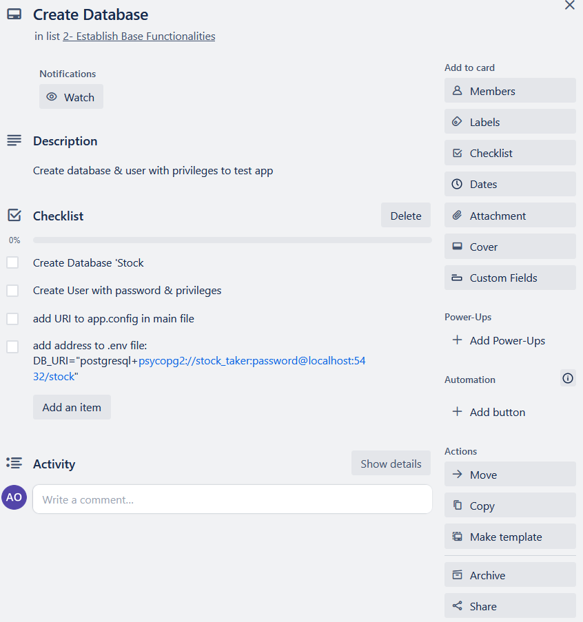

# Stock Management WebServer API - Documentation

## Github Repository: https://github.com/ArdaEO14455/T2A2_API_Webserver
## Trello Board: https://trello.com/b/fV1IFU7P/api-webserver

The problem I’m looking to tackle is stock management, specifically in highly dynamic environments with a need for frequent stock maintenance. I’ve decided to use the example of bar inventories to illustrate this issue. Traditionally, for a single bar in a venue, a member of staff needs to inspect each individual item in the bar inventory to create a stock list, before restocking the bar with items from back-of-house stock, and reporting low-stock items to management. This is typically time-consuming, and becomes exponentially more difficult to manage with busier services, as more items need restocking, it takes more time to determine stock needs / conduct the restock,  and time between busy periods dwindles, making general task and resource management more difficult. Furthermore, larger venues will often offer a far larger pool of different items across multiple bar facilities, each requiring their own stock restock from back-end stock storage, further exacerbating the logistical burden of this maintenance.

As such, optimising this process with an app that would both help track bar (or multiple bar) stock and back-of-house stock, and generate a stocklist on command would improve efficiency with this arduous but essential maintenance. With an app utilising a relational database, multiple facilities’ stock inventory can be managed and updated automatically when integrated with sale management software and adjusted manually where necessary. It would reduce the demand on time and alleviate the burden on staff, allowing resources to be allocated elsewhere.

This struggle with stock management is not exclusive to hospitality/bar environments either. fast-paced retail environments, event management and emergency healthcare facilities share a similar issue of frequent stock maintenance amidst dynamic functioning.

I elected to utilize a relational database for my data, and managed its development via PostgreSQL, an object-relational database management system(ORDBMS). One of the reasons for relational database implementation is that data entities within the different contexts of my app are expected to be highly related to one another. For example, a single entity might represent a single item that would be stocked in a hospitality venue, such as a bottle of wine. This entity would have its basic data registered in one table, such as its company, the type of wine, the alcohol content etc…, while its stock data such as its cost price, or the quantity of the item available would be stored in another. Meanwhile, another table would contain data pertaining to its stock in a particular facility, such as a venue bar: how many there are, how many should there be. Each of these tables contain attribute data related to multiple entities. As such, relational databases are beneficial as they can represent complex relationships between data. Relational databases also allow for efficient querying involving complex data sets and relationships. Given that this app involves effective tracking, updating and management of entities, querying and referencing data effectively is crucial for its function. Another aspect of relational databases is their predetermined structures to ensure consistency of data. While this may be a drawback in cases where models of data storage change frequently and subsequently require updating existing data, I predict that the models in this context would remain persistent, making this drawback less applicable. For app maintenance, given the long-term prevalence and use of relational databases, there are extensive development support tools and resources available, allowing for effective improvement and maintenance of the application, including object relational mappers such as SQLAlchemy which overcome the hurdle of data format alignment when communicating with the database through this API.

One drawback of concern is that relational databases cannot scale as well as non-relational databases with larger data volumes, and the demands placed on it with automating stock management. As such it might struggle to meet the needs of larger-scale implementations, for example chain-venues utilizing the app to manage stock across several locations. With that said I believe the bulk of its functionality and resource demand would not be consistently high, as stock-take is typically conducted intermittently throughout different services, limiting server traffic. As such I believe this drawback would only be applied in extreme cases of large-scale implementation.

PostgreSQLwas selected for its free, open source, highly expandable nature. It also allows for greater data integrity through implementing constraints and regulating data. One drawback is its lack of dedicated development found in proprietary data management systems such as Microsoft SQL Server, as such, troubleshooting and support is exclusively from the communities that use them. With that said, PostgreSQL is reported to be one of the most prevalent systems in use. As such, its developer community may prove to be sufficient.

https://insights.stackoverflow.com/survey/2021
https://db-engines.com/en/ranking

An Object Relational Mapper (ORM) is a method of converting or translating data between systems that use different languages.. Normally, Structured Querying Language (SQL) is needed to give commands to a database: to create tables, specify data attributes (columns) to create, read, update or delete data (rows) etc… However, programming languages such as Python or Javascript cannot execute such commands to the database without an ORM. In this case, the API I have developed and the database it stores and interacts with uses the ORM SQLAlchemy to facilitate communication between commands in the API and the database. This is called Object Relational Mapping, and it is the key feature of Object Relational Mappers.

Another beneficial feature that was mentioned earlier is the querying capabilities of ORMs. This allows the API to request data from the database. This in turn facilitates developers in designing complex operations to manipulate and interact with data within different models. Given that relational database models often involve complex data relationships, ORMs also enable simplified relationship and association handling between related data, allowing developers to design complex relationships between models more readily. With excessive database queries and user demands being one of the main weaknesses of relational databases, ORMs tend to have convenient functionalities for optimising queries such as caching, or lazy-loading. Lazy-loading is a mechanic whereby the loading of an object is only initialised upon demand, rather than upon application launch. This means that queries to required models may be executed slightly slower upon command, but time is saved in not having to load models or data that are not necessary for the given command. Caching involves data being partially-loaded to a more accessible, temporary layer of data-storage, allowing for more efficient retrieval.

https://docs.sqlalchemy.org/en/14/intro.html
https://stackoverflow.com/questions/36274/what-is-lazy-loading

##  API Endpoints
###  Please note: all request bodies must be sent in JSON format.

##  Item Routes - /items/

### See all items: /items/
###  Method: GET
* Arguments: None
* Description: Returns all entities within the items table
* No Request Body needed
* Example Request Response:
…
  {
        "id": 5,
        "name": "Sagitarious",
        "category": "Wine",
        "type": "Cabernet Sauvignon",
        "company": "Twelve Signs",
        "unit": "Bottle",
        "volume": 500
    },
    {
        "id": 9,
        "name": "Bloody Shiraz Gin",
        "category": "Spirit",
        "type": "Gin",
        "company": "Four Pillars",
        "unit": "Bottle",
        "volume": 1000
    },
…
*If no items are in the table:

    ‘error: "No items found’
*Error Code 404 Returned

### Create an Item: /items/  
### Method: POST
* Arguments: None
* Description: adds an entity to the Item table model, including its name, the company, the item category(Beer, Wine, Spirit, Other)*, the type (e.g. Shiraz, Pale Ale), its unit of container(Bottle, Can, Keg, Other)*, and its volume.
  * *Must be one of specified values
Request Body Example:
{
     "name": "Little Giant",
     "category": "wine",
     "type": "Shiraz",
     "company": "Unknown",
     "unit": "Bottle",
     "volume": 500
 }
Request Response Example:
{
    "category": "Wine",
    "company": "Unknown",
    "id": 1,
    "name": "Little Giant",
    "type": "Shiraz",
    "unit": "Bottle",
    "volume": 500
}
If item with the same name exists:

  ‘error: "item with that name already exists’
    *409 Error Code Returned

### Update an Item - /items/<'item_id'>
### Method: ‘PUT’, ‘PATCH’
* Argument: item ID value
* Description: allows users to update fields for specified items. Note that the Name, category and type must be specified.
* Example URI:

PATCH - localhost:5000/items/1

* Example Response Prior PATCH:
{
        "id": 1,
        "name": "Little Giant",
        "category": "Wine",
        "type": "Shiraz",
        "company": "Unknown",
        "unit": "Bottle",
        "volume": 500
    }

* Example Request Body:
{
     "name": "Twelve Signs",
     "category": "wine",
     "type": "Pinot Noir"
 }
* Request Response Post PATCH:
{
    "category": "Wine",
    "company": "Unknown",
    "id": 1,
    "name": "Twelve Signs",
    "type": "Pinot Noir",
    "unit": "Other",
    "volume": 500
}
* If no item matching the ID is found:
‘Error: item not found’
	*Error Code 404 Returned

### Retrieve an Item: /items/<'item_id'> 
### Method: GET
* Arguments: Item ID appended to URI
* Description: Return entity matching the item_ID in the URI
* No Request Body needed
* Example URI:

GET - localhost:5000/items/6

* Example Request Response:
{
    "category": "Wine",
    "company": "Unknown",
    "id": 6,
    "name": "Break Free",
    "type": "Skin-On Rose",
    "unit": "Bottle",
    "volume": 500
}
If item is not found:

‘Error: Item not found’

*Error Code 404 Returned

### Delete an Item: /items/<'item_id'> 
### Method: DELETE
* Arguments: Item ID appended to URI
* Description: Delete entity matching the item_ID in the URI
* No Request Body Needed
* Example URI:

DELETE - localhost:5000/items/1

* Request Response:

‘Item Deleted’

* If no item was found:

‘Error: item does not exist’
*Error Code 404 Returned

### Delete all Items: /items/clear
### Method: DELETE
* Arguments: ‘clear’
* Description: Delete all items in the Items table.
* No Request Body Needed
* Example URI:

DELETE - localhost:5000/items/clear

* Request Response:

‘Table Cleared’

## Stock Routes - /stock/

### See All Stock Items: /stock/
### Method: ‘GET’
* Arguments: None
* Description: Returns all entities within the stock table
* No Request Body needed
* Example Request Response:
…
{
        "stock_id": 2,
        "name": "Pink Gallah",
        "category": "Beer",
        "type": "Pink Lemonade Sour Ale",
        "available_stock": 20,
        "cost_price": 0
    },
    {
        "stock_id": 1,
        "name": "Nectar of the Hops",
        "category": "Beer",
        "type": "NEIPA",
        "available_stock": 20,
        "cost_price": 0
    }
…
* If no items are found:

‘error: no stock items found’
*Error Code 404 returned	

### Add Stock Item from Item Table: /stock/'<'item_id'>
### Method: ‘Post’
* Arguments: item ID from Item table
* Description: uses Item ID from the ID table to create a corresponding entity in the Stock table, backfilling most of the information from the items table. Only parameters to specify are the available stock and cost price of the item
* Example URI:

POST - localhost:5000/stock/1

* Example Request Body:
{
    "available_stock": 10,
    "cost_price": 10
}
* Example Request Response:
{
    "available_stock": 10,
    "category": "Beer",
    "cost_price": 10,
    "name": "Pash",
    "stock_id": 1,
    "type": "Sour"
}
* If stock ID is not found:

‘Error: stock item not found’
*Error code 404 returned
* If stock item with specified item_id already exists

‘Error: ‘stock item with that item ID already exists’’
*Error code 409 returned

### Retrieve a Stock Item: /stock/<'stock_id'> 
### Method: GET
* Arguments: Stock ID appended to URI
* Description: Return entity matching the stock ID in the URI
* No Request Body needed
* Example URI:

GET - localhost:5000/stock/1

* Example Request Body Response:
{
    "category": "Beer",
    "company": "Batch Brewing Company",
    "id": 1,
    "name": "Pash",
    "type": "Sour",
    "unit": "Can",
    "volume": 375
}
* If stock ID is not found:

‘Error: stock item not found’
*Error code 404 returned

### Update a Stock Item - /stock/<'stock_id'>
### Method: ‘PUT’, ‘PATCH’
* Argument: Stock ID value
* Description: allows users to update the 'available quantity' and 'cost_price' fields for specified stock items. Note that the available_quantity and cost price need to be specified
* Example Request Response pre PATCH:
{
    "available_stock": 20,
    "category": "Spirit",
    "cost_price": 0,
    "name": "Bloody Shiraz Gin",
    "stock_id": 9,
    "type": "Gin"
}

* Example URI:

PATCH - localhost:5000/stock/1

* Example Request Body:
	{
     "available_stock": 8,
     "cost_price": 15
}
* Example Request Response Post PATCH:
	{
    "available_stock": 8,
    "category": "Spirit",
    "cost_price": 15,
    "name": "Bloody Shiraz Gin",
    "stock_id": 9,
    "type": "Gin"
}
* If no stock item matching stock ID is found:

‘Error: stock item not found’
*Error code 404 returned

### Delete a Stock tem: /stock/<stock_id> 
### Method: DELETE
* Arguments: Stock ID appended to URI
* Description: Delete entity matching the stock ID in the URI
* No Request Body Needed
* Example URI:

DELETE - localhost:5000/stock/1

* Request Response:

‘Stock Item Deleted’

* If no stock item was found:

‘Error: Stock item does not exist’
*Error Code 404 Returned

### Delete all stock Items: /stock/clear
### Method: DELETE
* Arguments: ‘clear’
* Description: Delete all entities in the stock table.
* No Request Body Needed
* Example URI:

DELETE - localhost:5000/stock/clear

* Request Response:

‘Table Cleared’

### Add all items from the Item Table to the Stock Table, with available-quantities set to 10: /stock/add_all
### Method: POST
* Arguments: ‘clear’
* Description: This is a unique function that adds all items present in the Items table to the Stock table, setting all of their available quantities to a preset of 10.
* No Request Body Needed
* Example URI:

POST localhost:5000/stock/add_all

* Request Response:

‘All items added to stock’

* If no items are found:

	‘Error: Item not found’
*Error Code 404 Returned

## Bar Routes - /bar/

### See all bar items: /bar/
### Method: GET
* Arguments: None
* Description: Returns all entities within the bar table
* No Request Body needed
* Example Request Response:
{
    "bar_id": 1,
    "name": "Pash",
    "type": "Sour",
    "category": "Beer",
    "quantity": 18,
    "target_quantity": 20
},
{
    "bar_id": 2,
    "name": "Nectar of the Hops",
    "type": "NEIPA",
    "category": "Beer",
    "quantity": 18,
    "target_quantity": 20
},
...
* if no bar items are found:
'error': 'No bar items found'
*Error code 404 returned

###  Add bar item from stock table: /bar/<'stock_id'>
###  Method: POST
* Arguments: append the URI with stock ID
* Description: add item from the stock table to the bar table using the stock ID. note that the 'quantity' and 'target_quantity' parameters must be specified
* Example URI:

 POST - localhost:5000/bar/7

* Example Request Body:
{
    "quantity": 10,
    "target_quantity": 12
}
*Example Request Response:
{
    "bar_id": 2,
    "name": "Smirnoff Vodka",
    "type": "Vodka",
    "category": "Spirit",
    "quantity": 10,
    "target_quantity": 12
}
* if item with specified stock ID is not found:
'error: stock item not found'
* if item with specified stock ID already exists:
'error': 'bar item with that name already exists'
*Error code 409 returned

###  Update Bar Item: /bar/<'bar_id'>
###  Method: 'PATCH', 'PUT'
* Arguments: Append the URI with bar ID
* Description: allows users to update bar item 'quantity' and 'target quantity' fields. note that both parameters must be specified in the Request Body.
* Example Request Response pre PATCH:
{
    "bar_id": 2,
    "name": "Smirnoff Vodka",
    "type": "Vodka",
    "category": "Spirit",
    "quantity": 10,
    "target_quantity": 12
}
* Example URI:

PATCH - localhost:5000/bar/7

* Example Request Body:
{
    "quantity": 1,
    "target_quantity": 4
}

* Request Response post PATCH:
{
    "bar_id": 2,
    "name": "Smirnoff Vodka",
    "type": "Vodka",
    "category": "Spirit",
    "quantity": 1,
    "target_quantity": 4
}

* if item with specified bar ID not found:
'error': 'bar item not found'
*Error code 409 returned

###  Retrieve Bar Item: /bar/<'bar_id'>
###  Method: 'GET
* Arguments: Bar ID appended to URI
* Description: Return entity matching the Bar ID in the URI from the Bar Table
* No Request Body needed
* Example URI:

GET - localhost:5000/bar/8

* Example Request Response:
{
    "bar_id": 8,
    "category": "Spirit",
    "name": "Poor Toms Strawberry Gin",
    "quantity": 2,
    "target_quantity": 4,
    "type": "Gin"
}
* if no item matching the bar ID provided is found:
'error': 'Bar Item not found'
*Error code 409 returned

### Delete a BarItem: /bar/<'bar_id'> 
### Method: DELETE
* Arguments: Bar ID appended to URI
* Description: Delete entity matching the bar ID in the URI
* No Request Body Needed
* Example URI:

DELETE - localhost:5000/bar/1

* Request Response:

‘Bar Item Deleted’

* If no item was found:

‘Error: item does not exist’
*Error Code 404 Returned

### Delete all Bar: /items/clear
### Method: DELETE
* Arguments: ‘clear’
* Description: Delete all items in the Bar table.
* No Request Body Needed
* Example URI:

DELETE - localhost:5000/bar/clear

* Request Response:

‘Table Cleared’

### Add all items from the Stock Table to the Bar Table, with placeholder values provided: /bar/add_all
### Method: POST
* Arguments: ‘clear’
* Description: This is function adds all items present in the Stock table to the Bar table, providing placeholder values for required fields
* No Request Body Needed
* Example URI:

POST localhost:5000/bar/add_all

* Request Response:

‘All items added to bar inventory’

* If no items are found:

	‘Error: Stock Item not found’
*Error Code 404 Returned

## Stock List Routes - /stocklist/

### See all stocklist items: /stocklist/
###  Method: GET
* Arguments: None
* Description: Returns all entities within the stocklist table
* No Request Body needed
* Example Request Response:

    {
        "stocklist_id": 1,
        "name": "Sagitarious",
        "category": "Wine",
        "type": "Cabernet Sauvignon",
        "quantity_needed": 2
    },
    {
        "stocklist_id": 2,
        "name": "Break Free",
        "category": "Wine",
        "type": "Skin-On Rose",
        "quantity_needed": 2
    },
    ...
* if no stocklist items are found:
'Error: No Stocklist items found'
*Error code 404 returned

### Add Stock-list Item from bar Table: /stocklist/'<'stocklist_id'>
### Method: ‘Post’
* Arguments: Bar ID from bar table
* Description: uses bar ID from the bar table to create a corresponding entity in the stocklist table. 'quantity_needed' must be specified.
* Example URI:

POST - localhost:5000/stocklist/1

* Example Request Body:
{
    "quantity_needed": 2
}
* Example Request Response:
{
    "category": "Beer",
    "name": "Pash",
    "quantity_needed": 2,
    "stocklist_id": 1,
    "type": "Sour"
}
* If stock ID is not found:

‘Error: bar item not found’
*Error code 404 returned

* If stock item with specified bar_id already exists

‘Error: ‘stocklist item with that Bar ID already exists’’
*Error code 409 returned

### Retrieve a Stocklist Item: /stocklist/<'stock_id'> 
### Method: GET
* Arguments: Stocklist ID appended to URI
* Description: Returns entity matching the stock ID in the URI
* No Request Body needed
* Example URI:

GET - localhost:5000/stocklist/1

* Example Request Body Response:
{
    "stocklist_id": 1,
    "name": "Pash",
    "category": "Beer",
    "type": "Sour",
    "quantity_needed": 2
}
* If stocklist ID is not found:

‘Error: stocklist item not found’
*Error code 404 returned

HERE

### Update a Stocklist Item - /stocklist/<'stocklist_id'>
### Method: ‘PUT’, ‘PATCH’
* Argument: Stocklist ID value
* Description: allows users to update the 'quantity_needed' fields for specified stock items
* Example Request Response pre PATCH:
{
    "stocklist_id": 1,
    "name": "Pash",
    "category": "Beer",
    "type": "Sour",
    "quantity_needed": 2
}

* Example URI:

PATCH - localhost:5000/stocklist/1

* Example Request Body:
	{
        "quantity_needed": 5
}
* Example Request Response Post PATCH:
{
    "category": "Beer",
    "name": "Pash",
    "quantity_needed": 5,
    "stocklist_id": 1,
    "type": "Sour"
}
* If no stock item matching stocklist ID is found:

‘Error: stocklist item not found’
*Error code 404 returned

### Delete a Stocklist tem: /stocklist/<1> 
### Method: DELETE
* Arguments: Stocklist ID appended to URI
* Description: Delete entity matching the stock ID in the URI
* No Request Body Needed
* Example URI:

DELETE - localhost:5000/stocklist/1

* Request Response:

‘Stocklist Item Deleted’

* If no stocklist item was found:

‘Error: Stocklist item does not exist’
*Error Code 404 Returned

### Delete all stocklist Items: /stocklist/clear
### Method: DELETE
* Arguments: ‘clear’
* Description: Delete all entities in the stocklist table.
* No Request Body Needed
* Example URI:

DELETE - localhost:5000/stocklist/clear

* Request Response:

‘Table Cleared’

### Create Stocklist: /stocklist/create
### Method: POST
* Arguments: 'create'
* Description: This function queries all entities in the bar table, and creates corresponding stocklist items based on the difference between the targer quantity and the actual quantity of the bar item.
* No Request Body Needed
* Example URI:

POST - localhost:5000/stocklist/create

* Example Request Response:
...
{
        "stocklist_id": 7,
        "name": "Break Free",
        "category": "Wine",
        "type": "Skin-On Rose",
        "quantity_needed": 2
    },
    {
        "stocklist_id": 8,
        "name": "Smirnoff Vodka",
        "category": "Spirit",
        "type": "Vodka",
        "quantity_needed": 2
    }
...

* if no bar items are available: return blank list

### Create Stocklist: /stocklist/commit
### Method: PATCH
* Arguments: 'commit'
* Description: This function takes a given stocklist, and updates quantities in both the stock and bar tables of the respective items, and resets the stocklist table.
* No Request Body Needed

* Example:
  * query stock item, stock id = 1 :
  {
    "available_stock": 20,
    "category": "Beer",
    "cost_price": 0,
    "name": "Pash",
    "stock_id": 1,
    "type": "Sour"
}
  * query bar item, bar id = 1 :
  {
    "bar_id": 1,
    "category": "Beer",
    "name": "Pash",
    "quantity": 18,
    "target_quantity": 20,
    "type": "Sour"
}
  * query stocklist item, stocklist id = 1 :
  {
    "stocklist_id": 1,
    "name": "Pash",
    "category": "Beer",
    "type": "Sour",
    "quantity_needed": 2
}
  * commit stocktake URI:
  PATCH localhost:5000/stocklist/commit

  * query stock item, stock id = 1 :
  {
    "available_stock": 18,
    "category": "Beer",
    "cost_price": 0,
    "name": "Pash",
    "stock_id": 1,
    "type": "Sour"
}
  * query bar item, bar id = 1 :
  {
    "bar_id": 1,
    "category": "Beer",
    "name": "Pash",
    "quantity": 20,
    "target_quantity": 20,
    "type": "Sour"
}
  * view stocklist table via - GET localhost:5000/stocklist/ :
 []

Web Server API App - ERD

The ERD above was represents the models involved in this web Application. As illustrated above, there is a clear linear chain relationship across the models. The Items model is the starting point for fleshing out the data for each given entity, whereby basic details of each item are specified, and inputted: item name, its company, its category, the type within that category, its unit container, and its volume. the relationship to the next model in the chain is also specified, whereby it back-fills the corresponding attributes in the stock model, and specifies how changes to the item in the Item table will cascade through to the next table.

The Stock model represents the corresponding entities from the Item model in the context of a venue's back-of-house stock. As such, while it retains some of the information from the Item table, it excludes others, while incorporating attributes to represent the quantity available in stock and the cost price associated. As such, it also has a foreign key to the Item table, and represents a one-to-one relationship between them, as each entity in the Stock table must be unique within this model. The Stock model also specifies the relationship between it and the Bar model, where it in turn back-fills the bar table.

The Bar table represents the same entities in the context of the stock in a bar facility. Similar to the relationship between the Stock model and the Item model, the bar model contains a unique foreign key to the stock table, enforcing a one to one relationship between the Bar and Stock table models. Furthermore, the Bar table incorporates the entity quantity in the bar, and encodes the target quantity needed at each stock-take. The bar table in turn back-fills the Stocklist table.

Finally, the Stocklist table model contains a unique foreign key to the bar table to create another one to one relationship, and adds the 'quantity_needed' attribute to the entity's data. As a result of this chain, each entity from the Item table is represented uniquely across each context, backfilling information relevant to the subsequent table. This table in turn is used to generate the needed stock-list, and update the entity's data accordingly.

## Third Party Services
### Flask

Flask is a Python Web framework, allowing the application to execute HTTP requests (GET, PATCH, DELETE etc), facilitates routing, and handles template rendering. 

### Flask-Marshmallow

Flask-Marshmallow is an extension of the Flask library, and is responsible for the serialization and deserialization of objects in Object Relational models. this allows objects within the application to be serialized and converted into JSON more efficiently. As PostgreSQL requires the JSON format, Flask-Marshmallow is integral to the communication between the app and the database.

### SQLAlchemy
The ORM used in this API is SQLAlchemy, which allows the application to communicate with the database, and allow querying and execution of SQL commands via Python code. it allows the creation of table models, specifying the attributes (columns) involved in each table and design the relationships between models.

### PsycoPG2
Psychopg2 is a PostgreSQL adapter for python, facilitating the connection between the application and the database. This is seen in the .env file, where a databse URI is specified, including the database user details and password. This provides access to the database by establishing that the application is using the specified user and its privileges to interact with the database.

### Python-Dotenv
Dotenv is a Python library that allows specification of environmental variables in separate files such as the URI of the database user. This is often useful if sensitive information is involved, such as passwords required to access the database. this information can be put into separate '.env' files and excluded from repositories to ensure security of data. Dotenv can also be used to specify other environmental variables such as the local port through which the application runs.

## Project Management & Task Allocation

Development of the app was planned and tracked using a Trello board to distinguish the different components of the app, and the order they would be built up:

 The first step was to create an ERD to illustrate the design of the Database entities, their attributes, and their relationships, how they would back-fill one another and how they would be represented when returned.
 

From there, PostgreSQL was installed, the server was started, and the database was created along with the user, allocating privileges so that the application could interact with the database, make queries and manipulate the data. 

From there, the necessary third party applications were installed and the initial structure of the flask-app was created. 

 Once the app launched and its interactivity with the database was verified, the next stage was to build the models and schemas from the phase, specifying the relationships between models, and creating validations to correct and sanitize data for relevant fields.

 

 

 

 Cli commands were then created to test the functionality of the models within the app. These commands allowed me to populate the models and test how smoothly the models shared data, and how changes cascaded from one another.
 
 
 

  Once the relationships were fixed and error scenarios were accounted for, I moved on to route design and implementation. CRUD capability implementation was prioritized for each model first, along with the key stock-list creation and commitment routes. Each route was tested in both correct-input scenarios to test CRUD functionality, and invalid-input scenarios to test validation and error handling.

 

